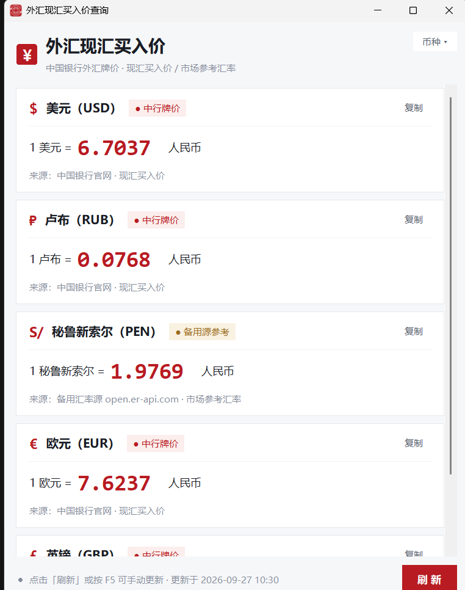

# 中行汇率换算（BocFxConverter）

Windows 桌面小工具：实时查询中国银行官网外汇牌价页的现汇买入价，支持多币种（默认美元、卢布、秘鲁新索尔；右上角「币种」菜单可勾选共 30 种），其中秘鲁新索尔（PEN）中行不挂牌，自动使用备用汇率源并标注「备用源参考」。



- 中行牌价单位为每 100 外币兑人民币，程序自动折算为「1 外币 = X 人民币」显示
- 币种面板头部有「全部选中/全部取消」按钮，一键切换所有币种；全部取消后卡片区显示空态指引，配置持久化为空列表
- 卡片支持拖拽排序：按住卡片拖到目标位置松开即可，顺序自动保存到配置（按住后移动 6px 内松开视为点击，不影响双击复制）
- 卡片上方「换算方向」按钮可对调换算方向（「1 外币 = X 人民币」⇄「1 人民币 = X 外币」）：仅用 1/汇率 重算展示，不重新抓取；方向随币种一起持久化
- 秘鲁新索尔备用源：open.er-api.com → currency-api@jsdelivr
- 点击窗口关闭按钮可选择「最小化到系统托盘」（后台保持运行，点击托盘图标重新打开并自动更新牌价）或「直接退出」；托盘右键菜单提供显示主窗口/退出
- 币种选择与换算方向持久化到 `%APPDATA%\中行汇率换算\config.json`（从 v1.6 及更早版本升级时，旧目录 `%APPDATA%\外汇现汇买入价查询\config.json` 会自动复制一份过来，旧文件原样保留）
- 纯标准库，无第三方依赖；需 Python 3.8+、Windows

## 运行

```text
python boc_fx_rates.py
```

命令行参数：

- `--selftest`：启动约 6 秒后自动退出（冒烟测试）
- `--debug`：在程序目录（不可写时回退 `%TEMP%`）写调试日志
- `--insecure`：证书校验失败时降级为不校验证书（默认不降级，谨慎使用）

## 打包

先准备构建环境（首次，或直接 `pip install -r requirements-dev.txt`）：

```powershell
python -m venv .venv
.\.venv\Scripts\pip install pyinstaller
```

然后一键打包：

```powershell
.\build.ps1
```

产物：`dist\中行汇率换算.exe`（PyInstaller onefile，含图标、版本信息，自动清理中间产物）。

说明：`build.ps1` 优先使用 `.venv`，若 venv 缺失/失效则自动回退系统 python（需装有 PyInstaller）。Python 3.14 环境请使用 PyInstaller 6.22+（6.21 及以下不支持其 Tcl/Tk 9 打包）。

## 首次运行提示（SmartScreen）

exe 未做代码签名，首次运行时 Windows SmartScreen 可能弹出「Windows 已保护你的电脑」。这是对无签名程序的常规拦截，属预期现象：

1. 点击「更多信息」；
2. 点击「仍要运行」即可（仅首次）。

也可以右键 exe → 属性 → 勾选「解除锁定」→ 确定，再双击运行。

## 发布

推送 `v*` 标签到 GitHub 后，CI（`.github/workflows/ci.yml`）会自动运行测试、构建 exe 并创建 Release 附件。

本地一键发布（CI 不可用时的备用通道）：

```powershell
.\release.ps1 -Tag v1.9.4 [-NotesFile 发布说明.md]
```

流程：校验 tag 与 `version_info.txt` 版本一致 → 工作区干净检查 → 跑测试 → 打包 → 推送 main 与 tag → 通过 GitHub API 创建 Release 并上传 exe（附件名 `boc-fx-rates-<tag>.exe`）。

## 测试

一键运行全部离线测试（解析 / HTTP 逻辑 / 配置，无需联网）：

```text
python run_tests.py
```

也可单独运行：

```text
python tests\test_parse.py
python tests\test_http.py
python tests\test_fetchall.py
python tests\test_color.py
```

> 说明：Linux/CI 上 GUI 相关断言会自动跳过，仅跑纯函数部分。

联网抓取测试（量级校验）：

```text
python _test_fetch.py
```

## 数据源

- 中国银行：<https://www.boc.cn/sourcedb/whpj/>
- 备用汇率源：<https://open.er-api.com/v6/latest/PEN>、jsdelivr 的 currency-api
